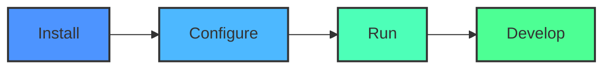
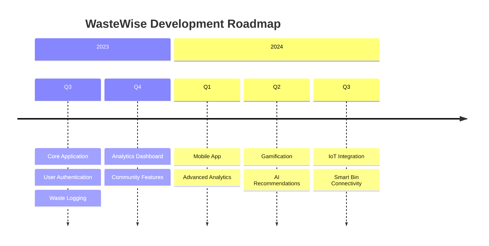

# WasteWise

<div align="center">
  
```
██╗    ██╗ █████╗ ███████╗████████╗███████╗██╗    ██╗██╗███████╗███████╗
██║    ██║██╔══██╗██╔════╝╚══██╔══╝██╔════╝██║    ██║██║██╔════╝██╔════╝
██║ █╗ ██║███████║███████╗   ██║   █████╗  ██║ █╗ ██║██║███████╗█████╗  
██║███╗██║██╔══██║╚════██║   ██║   ██╔══╝  ██║███╗██║██║╚════██║██╔══╝  
╚███╔███╔╝██║  ██║███████║   ██║   ███████╗╚███╔███╔╝██║███████║███████╗
 ╚══╝╚══╝ ╚═╝  ╚═╝╚══════╝   ╚═╝   ╚══════╝ ╚══╝╚══╝ ╚═╝╚══════╝╚══════╝
```

  

  <p>
    <a href="https://nextjs.org/"></a>
    <a href="https://firebase.google.com/"></a>
    <a href="https://www.typescriptlang.org/"></a>
  </p>
  
  <p>
    
    
    
    
  </p>
  
  <h3>🌱 Smart waste management for a cleaner future 🌱</h3>
  <p><em>Created by <a href="https://github.com/Zburgers/">Nakshatra (Zburgers)</a> for the Apex Hacks II Hackathon</em></p>
</div>

## 📋 Overview

WasteWise is a modern waste management application that helps users track, manage, and reduce their waste footprint. Built with Next.js and Firebase, it provides a responsive and intuitive interface for waste tracking, recycling information, and environmental impact analytics.

<div align="center">
  
</div>

## 🔄 How It Works

<div align="center">
  <table>
    <tr>
      <td align="center"><br />Register & Log Waste</td>
      <td align="center">➡️</td>
      <td align="center"><br />Track & Analyze</td>
      <td align="center">➡️</td>
      <td align="center"><br />Get Insights</td>
      <td align="center">➡️</td>
      <td align="center"><br />Reduce Impact</td>
    </tr>
  </table>
</div>

## ✨ Features

<div align="center">
  <table>
    <tr>
      <td>
        
        <h4>Waste Tracking</h4>
        <p>Log and monitor your waste production with intuitive dashboards</p>
      </td>
      <td>
        
        <h4>Recycling Guide</h4>
        <p>Learn what can be recycled in your area with our smart directory</p>
      </td>
    </tr>
    <tr>
      <td>
        
        <h4>Impact Dashboard</h4>
        <p>Visualize your environmental impact with interactive charts</p>
      </td>
      <td>
        
        <h4>Community Challenges</h4>
        <p>Join community initiatives to reduce waste together</p>
      </td>
    </tr>
  </table>
</div>

## 🛠️ Tech Stack

<div align="center">
  <table>
    <tr>
      <td align="center"><br/>Next.js</td>
      <td align="center"><br/>React</td>
      <td align="center"><br/>TypeScript</td>
      <td align="center"><br/>Firebase</td>
      <td align="center"><br/>Tailwind</td>
    </tr>
  </table>
</div>

## 📊 Analytics Dashboard

<div align="center">
  <table>
    <tr>
      <td width="33%"></td>
      <td width="33%"></td>
      <td width="33%"></td>
    </tr>
  </table>
</div>

## 🚀 Quick Start



<div align="center">
  
  ```bash
  # Clone repository
  git clone https://github.com/yourusername/WasteWise.git
  
  # Install dependencies
  npm install
  
  # Run development server
  npm run dev
  ```
  
  
</div>

### Prerequisites

- Node.js (v16+)
- npm or yarn
- Firebase account

### Installation

1. Clone the repository:
   ```bash
   git clone https://github.com/yourusername/WasteWise.git
   cd WasteWise
   ```

2. Install dependencies:
   ```bash
   npm install
   # or
   yarn install
   ```

3. Set up environment variables:
   Create a `.env.local` file with your Firebase configuration:
   ```
   NEXT_PUBLIC_FIREBASE_API_KEY=your-api-key
   NEXT_PUBLIC_FIREBASE_AUTH_DOMAIN=your-auth-domain
   NEXT_PUBLIC_FIREBASE_PROJECT_ID=your-project-id
   NEXT_PUBLIC_FIREBASE_STORAGE_BUCKET=your-storage-bucket
   NEXT_PUBLIC_FIREBASE_MESSAGING_SENDER_ID=your-messaging-sender-id
   NEXT_PUBLIC_FIREBASE_APP_ID=your-app-id
   ```

4. Start the development server:
   ```bash
   npm run dev
   # or
   yarn dev
   ```

5. Open [http://localhost:3000](http://localhost:3000) in your browser to see the application.

## 📱 App Screenshots

<div align="center">
  <table>
    <tr>
      <td></td>
      <td></td>
      <td></td>
      <td></td>
    </tr>
  </table>
</div>

## 📖 Usage

To get started with WasteWise:

<div align="center">
  <table>
    <tr>
      <td align="center"><br/>Sign up</td>
      <td align="center"><br/>Set up profile</td>
      <td align="center"><br/>Log waste</td>
      <td align="center"><br/>Track progress</td>
    </tr>
  </table>
</div>

For more detailed usage instructions, check out our [User Guide](docs/user-guide.md).

## 🗓️ Roadmap

<div align="center">
  


</div>

## 🧪 Testing

Run the test suite:

```bash
npm test
# or
yarn test
```

## 👥 Contributors

<div align="center">
  <a href="https://github.com/contributor1"></a>
  <a href="https://github.com/contributor2"></a>
  <a href="https://github.com/contributor3"></a>
  <a href="https://github.com/contributor4"></a>
  <a href="https://github.com/contributor5"></a>
</div>

## 🤝 Contributing

We welcome contributions to WasteWise! Please see our [Contributing Guidelines](CONTRIBUTING.md) for details on how to get involved.

## 📜 License

This project is licensed under the MIT License - see the [LICENSE](LICENSE) file for details.

## 👨‍💻 About the Creator

<div align="center">
  
  <h3>Nakshatra Kundlas (Zburgers)</h3>
  <p>WasteWise was developed by Nakshatra Kundlas for the <strong>Apex Hacks II Hackathon</strong>. The project aims to leverage technology to promote sustainable waste management practices and environmental consciousness.</p>
  
  <div>
    <a href="https://github.com/Zburgers/" target="_blank">
      
    </a>
    <a href="https://x.com/_nx8i_" target="_blank">
      
    </a>
    <a href="https://www.linkedin.com/in/nakshatra-kundlas-7a33a9170/" target="_blank">
      
    </a>
  </div>
</div>

## 🏆 Apex Hacks II Hackathon

<div align="center">
  
  <p>This project was created as part of the Apex Hacks II Hackathon, showcasing innovative solutions to environmental challenges through technology.</p>
</div>

## 📞 Support

<div align="center">
  <a href="https://github.com/Zburgers/WasteWise/issues"></a>
  <a href="mailto:support@wastewise.example.com"></a>
  <a href="https://discord.gg/wastewise"></a>
</div>

---

<div align="center">
  
  <p>Made with ❤️ for a cleaner planet by <a href="https://github.com/Zburgers/">Nakshatra (Zburgers)</a></p>
  
  <a href="https://github.com/Zburgers/WasteWise/stargazers">⭐ Star this project ⭐</a>
</div>
