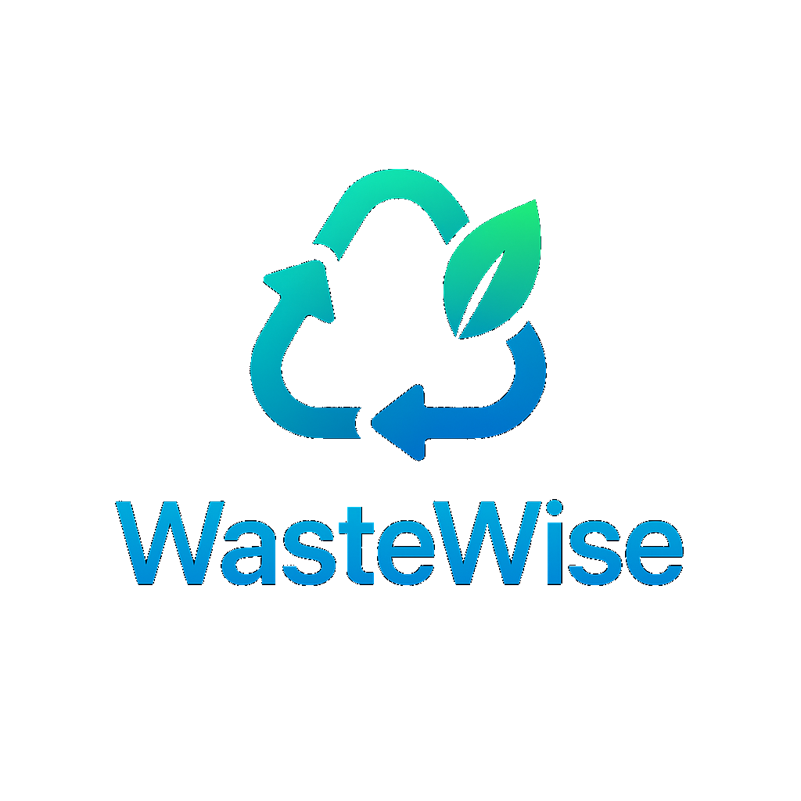
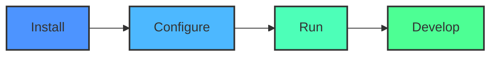

# ♻️🧠 WasteWise

<div align="center">
  
```
██╗    ██╗ █████╗ ███████╗████████╗███████╗██╗    ██╗██╗███████╗███████╗
██║    ██║██╔══██╗██╔════╝╚══██╔══╝██╔════╝██║    ██║██║██╔════╝██╔════╝
██║ █╗ ██║███████║███████╗   ██║   █████╗  ██║ █╗ ██║██║███████╗█████╗  
██║███╗██║██╔══██║╚════██║   ██║   ██╔══╝  ██║███╗██║██║╚════██║██╔══╝  
╚███╔███╔╝██║  ██║███████║   ██║   ███████╗╚███╔███╔╝██║███████║███████╗
 ╚══╝╚══╝ ╚═╝  ╚═╝╚══════╝   ╚═╝   ╚══════╝ ╚══╝╚══╝ ╚═╝╚══════╝╚══════╝
```

  

  <p>
    <a href="https://nextjs.org/"></a>
    <a href="https://firebase.google.com/"></a>
    <a href="https://www.typescriptlang.org/"></a>
  </p>
  
  <p>
    
    
    
    
  </p>
  
  <h3>🌱 A gamified, AI-powered Web3 app designed to make recycling intuitive, engaging, and rewarding 🌱</h3>
  <p><em>Created by <a href="https://github.com/Zburgers/">Nakshatra (Zburgers)</a> for the Apex Hacks II Hackathon</em></p>
</div>

## 📋 Inspiration

Ever stared at trash, wondering "Where does this even go?"

We did too. That simple question sparked WasteWise — a gamified, AI-powered Web3 app designed to make recycling intuitive, engaging, and rewarding.

We were inspired by:

- The sheer confusion around waste classification
- The massive environmental impact of improper recycling
- The missed opportunity to teach people — especially kids — about sustainable living

Tackling this serious challenge through something fun and intelligent was our moonshot.

WasteWise is more than an app. It's a movement.
A playful entry point into the world of eco-responsibility, blending AI + Web3 + gamification into a solution we actually want to use.

In a world full of complex climate problems, WasteWise is our way of starting with one simple act: sorting trash smarter.

## 🔄 What It Does

WasteWise helps users identify and sort waste correctly using AI image classification, while earning points, completing challenges, and competing on leaderboards.

It turns sustainability into a social, gamified, and educational experience — powered by modern tech.

<div align="center">
  <table>
    <tr>
      <td align="center"><br />Upload Photo</td>
      <td align="center">➡️</td>
      <td align="center"><br />AI Classification</td>
      <td align="center">➡️</td>
      <td align="center"><br />Earn Points</td>
      <td align="center">➡️</td>
      <td align="center"><br />Compete Globally</td>
    </tr>
  </table>
</div>

## 🧩 Core Features

<div align="center">
  <table>
    <tr>
      <td>
        
        <h4>AI Waste Classifier</h4>
        <p>Upload a photo, get instant classification + region-specific disposal tips</p>
      </td>
      <td>
        
        <h4>Chat with WasteWizard</h4>
        <p>AI chatbot answers recycling queries with local awareness</p>
      </td>
    </tr>
    <tr>
      <td>
        
        <h4>Community Challenges</h4>
        <p>Missions + social sharing for bonus points</p>
      </td>
      <td>
        
        <h4>Global Leaderboards</h4>
        <p>Compete weekly, monthly, and all-time</p>
      </td>
    </tr>
    <tr>
      <td>
        
        <h4>Levels + Badges</h4>
        <p>XP-driven levels + achievement-based badge system</p>
      </td>
      <td>
        
        <h4>Mintable NFT Badges</h4>
        <p>On-chain proof of eco-effort</p>
      </td>
    </tr>
    <tr>
      <td>
        
        <h4>Web3 Auth</h4>
        <p>Sign in with MetaMask, Google, or Apple (WIP)</p>
      </td>
      <td>
        
        <h4>Sustainability First</h4>
        <p>Learn while taking action</p>
      </td>
    </tr>
  </table>
</div>

<div align="center">
  <p><em>It's not just a tool — it's a game, a classroom, and a movement.</em></p>
</div>

## 🔐️ How We Built It

This project started as a curious experiment and scaled into an ambitious Web3 MVP.

We started prototyping in Firebase Studio, brainstorming with Gemini + ChatGPT, then transitioned to a full-stack modern dev environment for polish and control.

### 🔧 Build Phases

**🧠 AI Core**
- Built the image classification module for waste detection
- Integrated WasteWizard chatbot via Genkit + Google AI

**🎮 Gamification**
- MVP point system, leveling, and badge logic (memory state)
- Community challenge flow added

**🌐 Web3 Auth & NFTs**
- MetaMask integration via Web3Auth + Ethers.js
- Badge-to-NFT minting for bragging rights

**🎨 UI/UX**
- Tailwind + Radix UI for clean design
- Framer Motion for animations
- Component render optimization for speed

**🗃️ Backend (WIP)**
- Partial PostgreSQL + Prisma setup
- Mocked in-memory state for fast prototyping

### 🧰 Tech Stack

<div align="center">
  <table>
    <tr>
      <th>Layer</th>
      <th>Technologies Used</th>
    </tr>
    <tr>
      <td>Frontend</td>
      <td>Next.js, React, TypeScript, Tailwind CSS, Radix UI, Framer Motion</td>
    </tr>
    <tr>
      <td>State/Forms</td>
      <td>React Hook Form, Tanstack React Query</td>
    </tr>
    <tr>
      <td>Data Viz</td>
      <td>Recharts (Leaflet dropped)</td>
    </tr>
    <tr>
      <td>Backend</td>
      <td>Next.js API Routes, Prisma, PostgreSQL (partial), Firebase</td>
    </tr>
    <tr>
      <td>AI</td>
      <td>Genkit, Google AI</td>
    </tr>
    <tr>
      <td>Auth/Web3</td>
      <td>Firebase Auth, Web3Auth, WalletConnect, MetaMask, Ethers.js</td>
    </tr>
    <tr>
      <td>Tooling</td>
      <td>ESLint, dotenv, Turbopack, Patch-package, TSX</td>
    </tr>
  </table>
</div>

## 🚧 Challenges We Ran Into

- 🗺️ **Map module bugs (Leaflet)**: Dropped to prioritize core functionality
- ⚙️ **Backend bottlenecks**: Time constraints limited DB implementation
- 🎞️ **Framer Motion**: Performance impact required animation cuts
- 🔐 **Apple OAuth**: Needed credentials we couldn't fetch in time
- ⏱️ **Time pressure**: Building AI + Web3 + gamification in 48 hrs was intense

## ✅ Accomplishments We're Proud Of

- 🎯 Shipped a fully functional MVP with real UX
- 🚀 Integrated Web3: Wallet auth + NFT badge minting
- 🎮 Built a gamified platform that's fun and educational
- 💡 Made something we'd actually use
- ♻️ Built a tool that blends sustainability, tech, and behavior change

## 🧠 What We Learned

- 🔍 Polished solutions require tough trade-offs
- 🤝 Gamification can drive real change
- 🧠 Firebase Studio + Gemini = MVP prototyping superpower
- 💡 Web3 isn't scary — it enables trust + ownership
- 🌱 Recycling in Delhi is broken — we built a starting point

## 🚀 Quick Start



<div align="center">
  
  ```bash
  # Clone repository
  git clone https://github.com/Zburgers/WasteWise.git
  
  # Install dependencies
  npm install
  
  # Run development server
  npm run dev
  ```
</div>

### Prerequisites

- Node.js (v16+)
- npm or yarn
- Firebase account

### Installation

1. Clone the repository:
   ```bash
   git clone https://github.com/Zburgers/WasteWise.git
   cd WasteWise
   ```

2. Install dependencies:
   ```bash
   npm install
   # or
   yarn install
   ```

3. Set up environment variables:
   Create a `.env.local` file with your Firebase configuration:
   ```
   NEXT_PUBLIC_FIREBASE_API_KEY=your-api-key
   NEXT_PUBLIC_FIREBASE_AUTH_DOMAIN=your-auth-domain
   NEXT_PUBLIC_FIREBASE_PROJECT_ID=your-project-id
   NEXT_PUBLIC_FIREBASE_STORAGE_BUCKET=your-storage-bucket
   NEXT_PUBLIC_FIREBASE_MESSAGING_SENDER_ID=your-messaging-sender-id
   NEXT_PUBLIC_FIREBASE_APP_ID=your-app-id
   ```

4. Start the development server:
   ```bash
   npm run dev
   # or
   yarn dev
   ```

5. Open [http://localhost:3000](http://localhost:3000) in your browser to see the application.

## 📱 App Screenshots

<div align="center">
  <table>
    <tr>
      <td></td>
      <td></td>
      <td></td>
      <td></td>
    </tr>
  </table>
</div>

## 💚 Final Note

WasteWise is more than a hackathon project.
It's a bold, beautiful step toward a cleaner, smarter world — powered by AI, Web3, and people like you.

## 🧪 Testing

Run the test suite:

```bash
npm test
# or
yarn test
```

## 👥 Contributors

<div align="center">
  <a href="https://github.com/contributor1"></a>
  <a href="https://github.com/contributor2"></a>
  <a href="https://github.com/contributor3"></a>
  <a href="https://github.com/contributor4"></a>
  <a href="https://github.com/contributor5"></a>
</div>

## 🤝 Contributing

We welcome contributions to WasteWise! Please see our [Contributing Guidelines](CONTRIBUTING.md) for details on how to get involved.

## 📜 License

This project is licensed under the MIT License - see the [LICENSE](LICENSE) file for details.

## 👨‍💻 About the Creator

<div align="center">
  
  <h3>Nakshatra Kundlas (Zburgers)</h3>
  <p>WasteWise was developed by Nakshatra Kundlas for the <strong>Apex Hacks II Hackathon</strong>. The project aims to leverage technology to promote sustainable waste management practices and environmental consciousness.</p>
  
  <div>
    <a href="https://github.com/Zburgers/" target="_blank">
      
    </a>
    <a href="https://x.com/_nx8i_" target="_blank">
      
    </a>
    <a href="https://www.linkedin.com/in/nakshatra-kundlas-7a33a9170/" target="_blank">
      
    </a>
  </div>
</div>

## 🏆 Apex Hacks II Hackathon

<div align="center">
  
  <p>This project was created as part of the Apex Hacks II Hackathon, showcasing innovative solutions to environmental challenges through technology.</p>
</div>

## 📞 Support

<div align="center">
  <a href="https://github.com/Zburgers/WasteWise/issues"></a>
  <a href="mailto:support@wastewise.example.com"></a>
  <a href="https://discord.gg/wastewise"></a>
</div>

---

<div align="center">
  
  <p>Made with ❤️ for a cleaner planet by <a href="https://github.com/Zburgers/">Nakshatra (Zburgers)</a></p>
  
  <a href="https://github.com/Zburgers/WasteWise/stargazers">⭐ Star this project ⭐</a>
</div>
